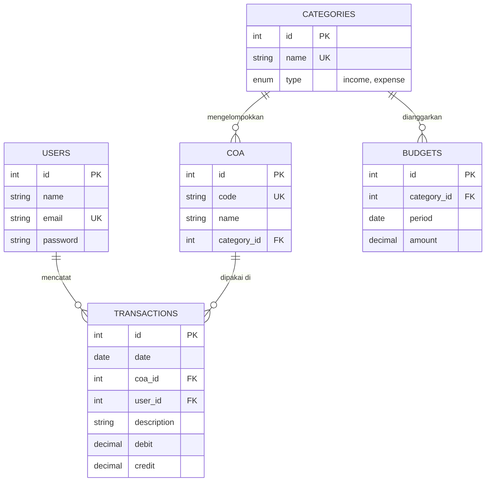

# Entity Relationship Diagram

```mermaid
erDiagram
    USERS ||--o{ TRANSACTIONS : "mencatat"
    CATEGORIES ||--o{ COA : "mengelompokkan"
    COA ||--o{ TRANSACTIONS : "dipakai di"
    CATEGORIES ||--o{ BUDGETS : "dianggarkan"

    USERS {
        int id PK
        string name
        string email UK
        string password
    }

    CATEGORIES {
        int id PK
        string name UK
        enum type "income, expense"
    }

    COA {
        int id PK
        string code UK
        string name
        int category_id FK
    }

    TRANSACTIONS {
        int id PK
        date date
        int coa_id FK
        int user_id FK
        string description
        decimal debit
        decimal credit
    }

    BUDGETS {
        int id PK
        int category_id FK
        date period
        decimal amount
    }
```